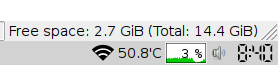

# Xfce4 Cpu Plugin
CPU load plugin for XFCE4 panel (graph and percentage).  
It is ported from pplug-cpu.  

## Build
install these build dependencies...  
* libgtk-3-dev  
* libxfce4panel-2.0-dev  
* libxfce4ui-2-dev  

Open terminal and change directory to src directory.  
Run this command...  
`make`  

### Install and Uninstall
To install run...  
`sudo make install`  

To uninstall run...  
`sudo make uninstall`  

After installing go to panel settings and add this plugin to your panel.  

### Screenshot
  
